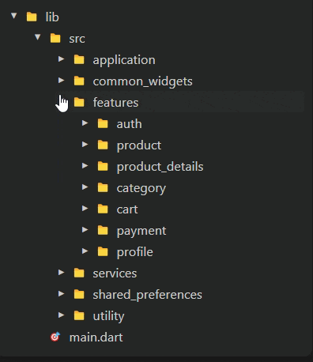

# 🚀 raihan_cli – Flutter Feature Scaffolding CLI Tool

`raihan_cli` is a Dart-based command-line tool designed to **automate feature creation and deletion** in Flutter projects using the **MVC** or **MVVM** architectural patterns. It helps developers maintain a clean and consistent project structure while saving time on repetitive boilerplate setup.

---

## 📦 Installation

To install globally from the Pub.dev package:
```
dart pub global activate raihan_cli
```

Alternatively, to install from the Git repository:

```bash
dart pub global activate --source git https://github.com/raihansikdar/raihan_cli.git
```
✅ Deactivating the CLI Package:
```
dart pub global deactivate raihan_cli

```

## ✅ Verify Installation

### macOS/Linux
which raihan_cli

### Windows
where raihan_cli


## 📁 What It Does

1. ✅ Scaffolds folders and files for new features (MVC or MVVM)
2. 🗑️ Removes entire feature folders safely
3. 🔧 Saves architecture and path preferences to reduce prompts
4. 🛠️ Supports custom folder paths (e.g., lib/core/feature_name) or default feature-based structure (lib/src/features/feature_name)

## 🧪 Basic Usage
### ▶️ Create a New Feature
```
raihan_cli <feature_name>

```
You’ll be prompted to choose:

Folder structure type:

1: Default (lib/src/features/<feature_name>)

2: Custom (lib/<custom_path>/<feature_name>)


> **Note:** You must configure the path type on the first run. The tool will remember your choice.


Architecture type:

1: MVC

2: MVVM

> **Note:** You must configure the state management on the first run. The tool will remember your choice.


Then your feature folder will create successfully.


### If folder is not showing then collapse your parent folder like this



### You can skip prompts by providing the architecture:

```
raihan_cli dashboard mvvm

```
### 🗑️ Remove an Existing Feature
```
raihan_cli remove <feature_name>

```
> **Note:** If folder is not showing then collapse your parent folder.

Confirms and deletes the feature directory based on previously saved config.

## 💡 Architecture Details

### 📁 MVC Folder Structure

```
lib/src/features/<feature_name>/
├── controllers/
│   └── <feature_name>_controller.dart
├── model/
│   └── <feature_name>_model.dart
└── views/
    ├── screen/
    │   └── <feature_name>_screen.dart
    └── widget/
```

### 📁 MVVM Folder Structure
```
lib/core/<feature_name>/   # if custom path is "core"
├── model/
│   └── <feature_name>_model.dart
├── view_model/
│   └── <feature_name>_view_model.dart
├── repository/
│   ├── <feature_name>_repository.dart
│   └── <feature_name>_repository_impl.dart
└── views/
    ├── screen/
    │   └── <feature_name>_screen.dart
    └── widget/

```
## 🔄 Reset Configuration

```
# Windows
del tool\.cli_architecture_config

# macOS/Linux
rm tool/.cli_architecture_config

```


## 📜 License

This project is licensed under the MIT License. See the LICENSE file for more details.

```text
MIT License

Copyright (c) 2025 Raihan Sikdar

Permission is hereby granted, free of charge, to any person obtaining a copy...